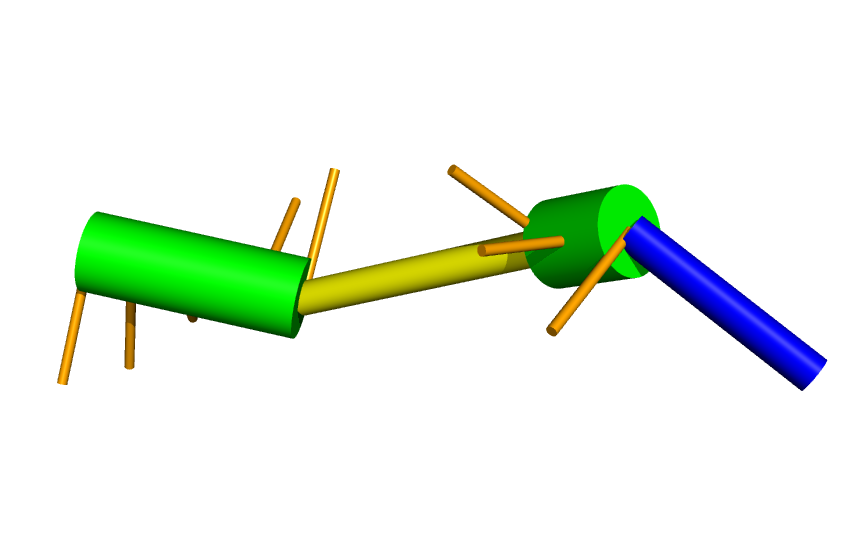
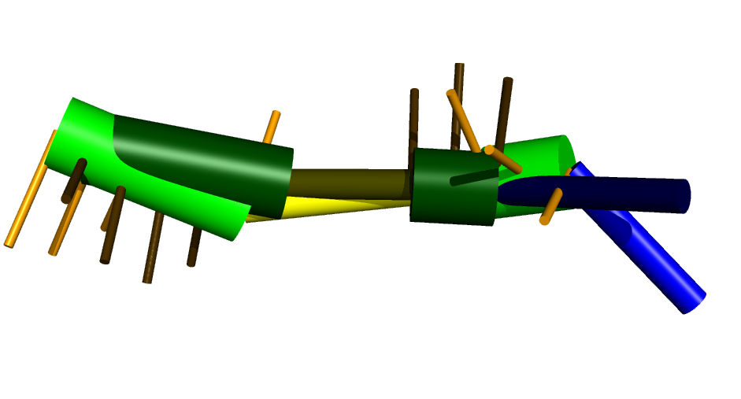

.. _ernwin_tutorial:

Coarse Grain Tertiary RNA Structure Prediction
==============================================

A Simple Example
~~~~~~~~~~~~~~~~ 

The simplest scenario involves providing a sequence and a secondary structure
as input and obtaining coarse-grain tertiary structures as output. The input
will be a fasta file augmented with secondary structure::

    >2mis
    GAGCUGCAGCACGAAAGUGACGGCUC
    ((((((...(((....))).))))))

With this, we can invoke `ernwin` using the `ernwin_go.py` script::

    ernwin_go.py fastas/2mis.fa

This will start the sampling engine. The default number of iterations is 10000
(although this number can be changed using the `--iterations` flag). Running
`ernwin_go.py` will create an output directory with the id of the provided
sequence (*2mis*, in this case). This directory will contain the top 3 lowest
energy sampled structures. The format for these structures is described in the
documentation of the forgi_ package. They can be visualized using the `visualize_cg.py`
script provided by forgi_::

    visualize_cg.py 2mis/best0.coord

To yield something like this:

.. _forgi: http://www.tbi.univie.ac.at/~pkerp/forgi

We can also compare it to the native structure (in dark green):

This was generated by first extracting the coarse grain representation from 
the pdb file, then visualizing and aligning (using the `-a` option of `visualize_cg.py`)::

    pdb_to_cg.py ~/projects/ernwin/fess/structures/2mis.pdb > 2mis_native.cg
    visualize_cg.py 2mis/best0.coord 2mis_native.cg -a

Sampling from an Existing CG File
~~~~~~~~~~~~~~~~~~~~~~~~~~~~~~~~~

For benchmarking purposes, it's often easier to start with the native
structure. This allows one to monitor the RMSD between the current sampled
structure and the native as the simulation progresses. Doing so is almost
identical to starting from a fasta file, wherein the argument to
``ernwin_go.py`` is the cg file instead::

    ernwin_go.py 2mis_native.cg

To create a cg file from a pdb file, see the example in the previous section
or the relevant documentation for the `forgi package <http://www.tbi.univie.ac.at/~pkerp/forgi/threedee_tutorial.html#creating-a-coarse-grain-3d-representation-of-an-rna-molecule>`_.

Parsing The Log File
~~~~~~~~~~~~~~~~~~~~~~~

As ernwin runs, it outputs diagnostic information about the sampling procedure::

    native_energy [2mis_A 26]:  63  19.7  1.887 | min:  2.58 (44.46)  1.75 | extreme_rmsds:  1.45  1.89 (3.60) | [time: 3.8]

The columns in the output file are arranged as follows:

* *native_energy:* Just an identifier, no meaning.
* *2mis_A:* The id of the structure (as specified in the fasta file, or the name of the pdb file)
* *26:* The number of nucleotides in the structure
* *63:* The iteration number
* *19.7* The (weighted) energy of this structure
* *1.887* The RMSD between this structure and the native (0.000 if no native structure is specified, as when a fasta file is provided as an input)
* *2.58:* The lowest (unweighted) energy sampled so far
* *44.46:* The (weighted) energy of the native structure
* *1.75:* The RMSD of the lowest-energy structure so far
* *1.45:* The lowest RMSD sampled so far
* *1.89:* The largest RMSD sampled so far
* *3.60:* The (unweighted) energy of the current structure
* *3.8:* The length of the time that this simulation has been running (in seconds)

This information can be loaded and parsed using the fess.parsing library::

    for line in fp.parse_ernwin_log('log.txt'):                                                        
        print (line.struct_id,
               line.struct_len,
               line.iteration,
               line.energy,
               line.rmsd,
               line.min_energy,
               line.native_energy,
               line.best_rmsd,
               line.min_rmsd,
               line.max_rmsd,
               line.no_bg_energy,
               line.time)

